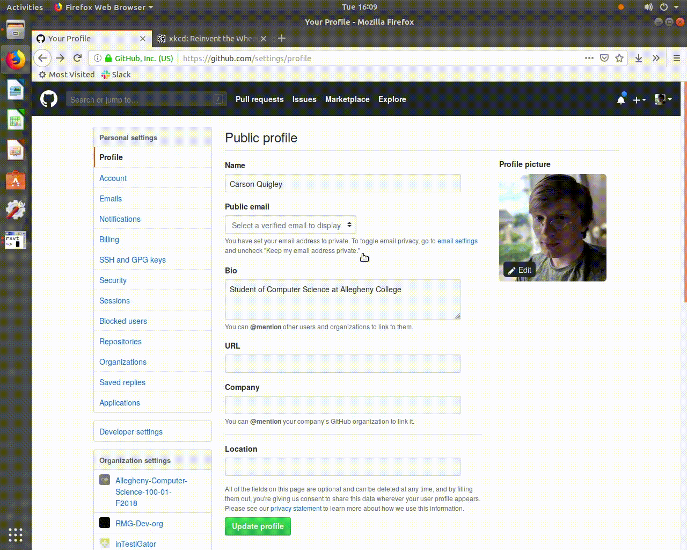
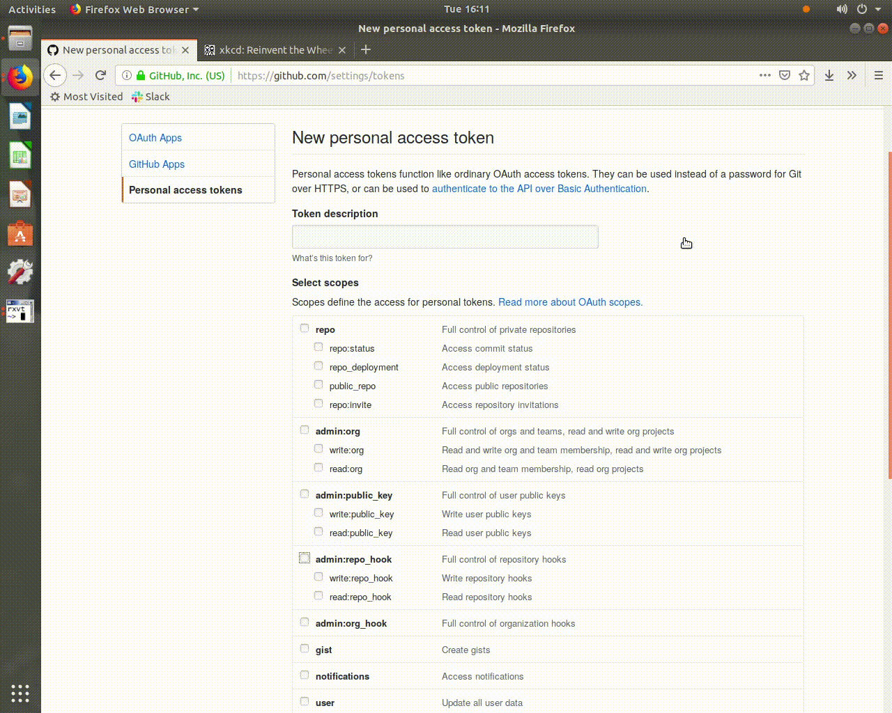

# pytest-blame

-------------------------------------------------------------------------------

A pytest plugin that helps developers build successful test cases by providing
them with GitHub commit information when their test cases fail.

A Python Plugin for Tracking Test Case Status
---------------------------------------------

Everyone uses pytest. Or at least, everyone should. It's a super useful testing
program with an easy-to-use syntax. Pytest Blame is a pytest plugin that allows
pytest to do a quick check to Github to make sure the most recent commit is
passing your cases. If somebody broke your cases, ``pytest-blame`` will display
all the commits pushed since the build broke as well as who pushed each commit.
This keeps team workflow transparent and allows for semi-realtime updates from
Github without having to open a browser. Since ``pytest-blame`` can check up on
the online repository as frequently as every time you run your test suite, there
is less risk of a broken commit going unnoticed until a merge conflict occurs.

Installation
------------

To install ``pytest-blame`` you will need to clone the `git repository
<https://github.com/inTestiGator/pytest-blame>`. Once the repository has been
cloned you will need to run the install script to update your pytest
configuration:

.. code-block::

   pipenv run python setup.py install

After ``pytest-blame`` has been successfully installed you will need to generate
a Github User Token. To do this you will need to go to ``settings`` in your github
profile:

run pytest with
the ``--track`` flag and you will see a report containing GitHub information at
the top of your pytest report. ``pytest-blame`` will display the number of test
cases that passed in the latest commit to GitHub, so you can compare it with your
current rate.

To run:
As of now there isn't a way to see the output in a standard way.
To run you need to copy the contents of ``pytest_blame.py`` over to ``tests/conftest.py``

.. code-block::

   cp pytest_blame.py tests/conftest.py

then running ``pytest --track tests/`` to see the output of the plugin.

`Sample PyPI page <https://test.pypi.org/project/pytest-blame/>`_

Install the most recent version of this plugin with

.. code-block::

   pip install -i https://test.pypi.org/simple/ pytest-blame

Additional Features
-------------------

Read commits on GitHub and print out information since the most recent commit
that passed test case.
